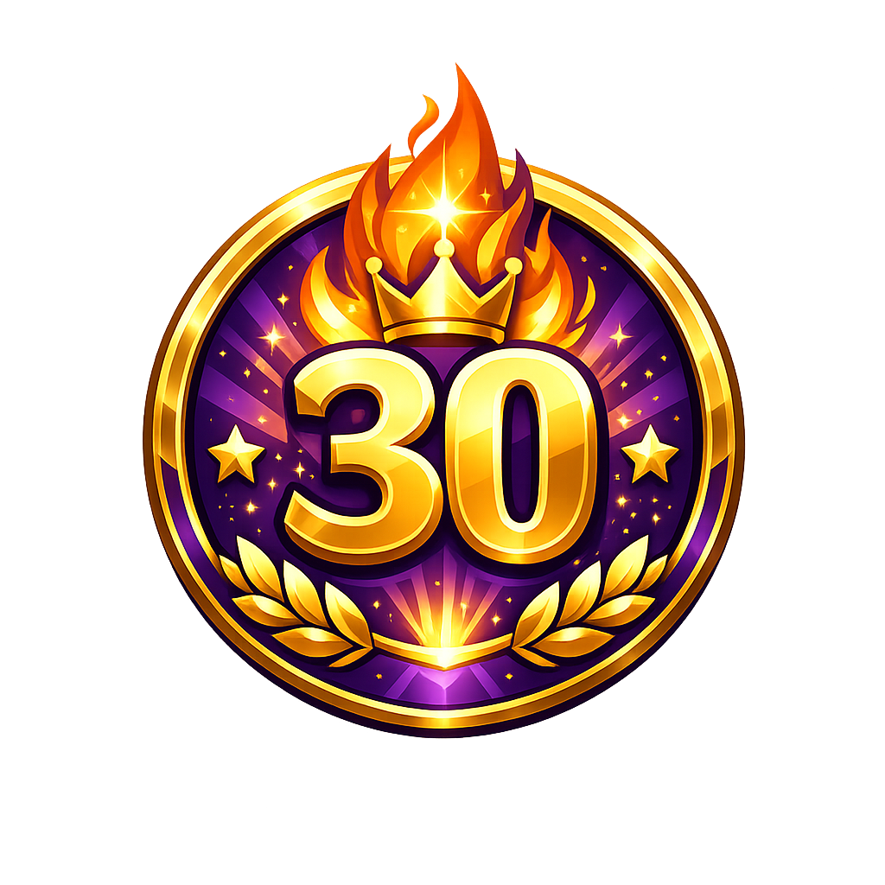
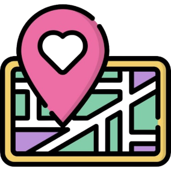
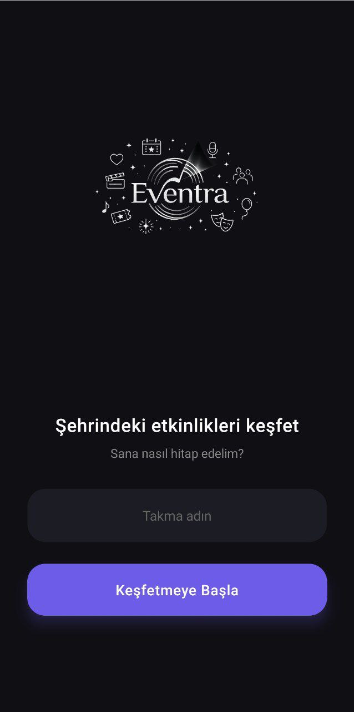
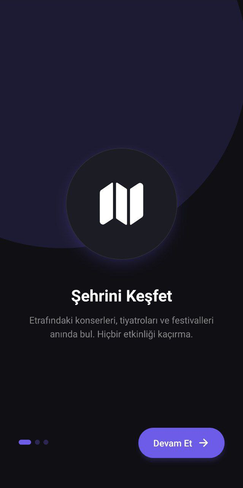
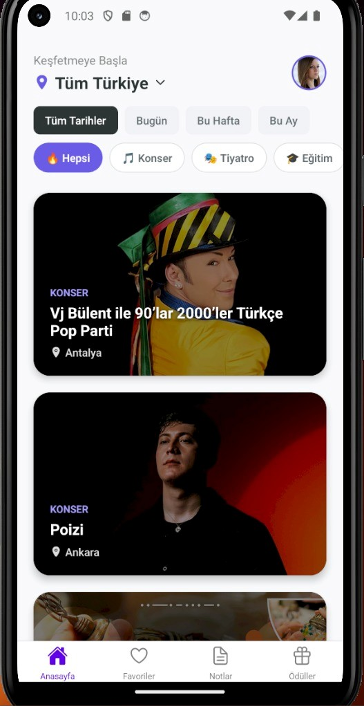
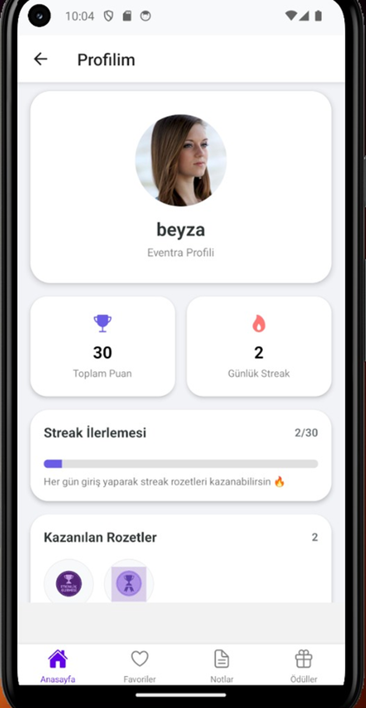
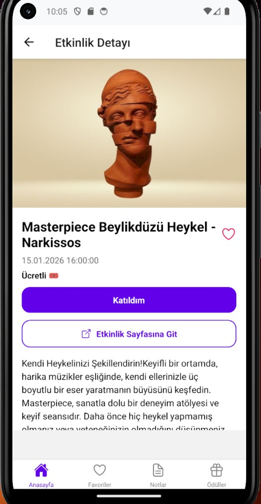
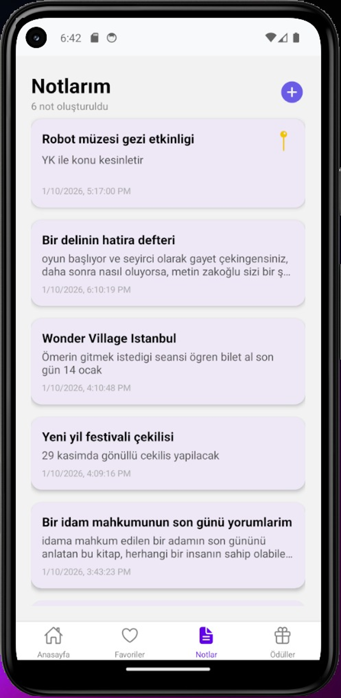
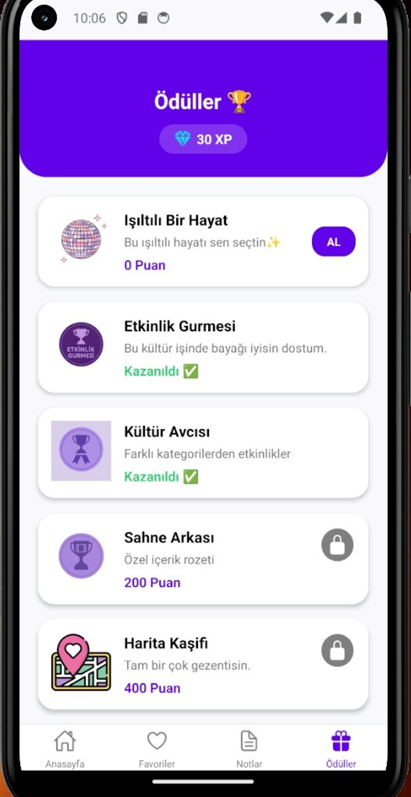

<div align="center">
  
</div>

<div align="center">

### Oyunlaştırma Destekli Mobil Etkinlik Keşif ve Takip Uygulaması


> **Kullanıcıyı etkinlik keşfine teşvik eden,<br>
oyunlaştırma temelli mobil etkinlik deneyimi.**

</div>

---

## 📌 İçindekiler
- [Proje Hakkında](#-proje-hakkında)
- [Motivasyon ve Problem Tanımı](#-motivasyon-ve-problem-tanımı)
- [Temel Özellikler](#-temel-özellikler)
- [Uygulama Mimarisi](#-uygulama-mimarisi)
- [Oyunlaştırma Sistemi](#-oyunlaştırma-sistemi)
- [Veri Yönetimi](#-veri-yönetimi)
- [Ekran Görüntüleri](#-ekran-görüntüleri)
- [Kurulum & Çalıştırma](#-kurulum--çalıştırma)
- [Kullanılan Teknolojiler](#-kullanılan-teknolojiler)
- [Akademik Not](#-akademik-not)
- [Geliştiriciler](#-geliştiriciler)

---

## Proje Hakkında

**Eventra**, kullanıcıların bulundukları şehirdeki güncel etkinlikleri
keşfetmelerini, bu etkinliklerle etkileşime geçmelerini ve düzenli
kullanım alışkanlığı kazanmalarını amaçlayan bir **mobil etkinlik keşif
uygulamasıdır**.

Uygulama; klasik etkinlik listeleme yaklaşımını,
**puan, streak ve rozet mekanikleri** ile destekleyerek
kullanıcı deneyimini oyunlaştırılmış bir yapıya dönüştürür.

---

## Motivasyon ve Problem Tanımı

Mevcut etkinlik platformlarının büyük bir kısmı:

- Kullanıcıyı pasif içerik tüketicisi konumunda bırakır  
- Düzenli kullanım için teşvik mekanizması sunmaz  

Eventra’nın temel motivasyonu:

- Kullanıcıyı **aktif katılıma teşvik etmek**
- Etkinlik deneyimini **kişiselleştirmek**
- Uygulamaya geri dönüşü **oyunlaştırma** ile desteklemektir

---

## Temel Özellikler

- Şehir, kategori ve tarih bazlı etkinlik filtreleme  
- Etkinlikleri favorilere ekleme / çıkarma  
- Etkinliklere özel kişisel notlar oluşturma  
- Etkinliğe katılım bildirimi  
- Günlük giriş (streak) takibi  
- Puan, rozet ve ödül sistemi  
- Kullanıcı profili ve istatistik ekranı  

---

## Uygulama Mimarisi

<p align="center">
  
</p>

Eventra, **React Navigation** kullanılarak oluşturulmuş  
**Stack ve Bottom Tab** navigasyonlarının birlikte kullanıldığı
modüler bir mimariye sahiptir.

Bu mimari yapı, uygulama içi navigasyonun yanı sıra
veri sürekliliğini sağlamak amacıyla **AsyncStorage**
kullanımıyla desteklenmiştir.

Kullanıcıya ait streak, puan, son giriş tarihi ve
favori verileri cihaz üzerinde güvenli şekilde
saklanmaktadır.

### Navigasyon Yapısı
- **Root Stack**
  - Intro
  - Onboarding
  - MainTabs
- **Bottom Tab Navigation**
  - Anasayfa (Stack)
  - Favoriler
  - Notlar (Stack)
  - Ödüller

---

## Oyunlaştırma Sistemi

### Günlük Streak Mekaniği
- Günlük uygulama girişleri takip edilir  
- Bir gün giriş yapılmazsa streak sıfırlanır  
- Streak, özel rozetlerin kilidini açar  

<p align="center">
  
  
  
</p>

---

### Rozet ve Ödüller

<p align="center">
  
  
  
  
  
</p>

**Ödül Türleri**
- **STREAK** → Günlük kullanım başarımına bağlı  
- **SHOP** → Puan harcanarak satın alınan ödüller  

### Puan Kazanma Mantığı

Uygulama içerisinde kullanıcı etkileşimleri,
**kontrollü ve adil bir puan sistemi** ile ödüllendirilmektedir.

Puanlama kuralları aşağıdaki gibidir:

* **Günlük giriş (streak)**
  * Her gün ilk girişte **+10 puan**
  * Aynı gün tekrar girişte puan verilmez

* **Favori ekleme**
  * Gün içinde yapılan **ilk favori ekleme** için **+5 puan**
  * Aynı gün içinde eklenen diğer favoriler puan kazandırmaz

* **Not ekleme**
  * Gün içinde eklenen **ilk not** için **+5 puan**
  * Aynı gün içinde eklenen diğer notlar puan kazandırmaz

* **Etkinliğe katılım bildirimi**
  * Her etkinlik için **tek seferlik +20 puan**
  * Aynı etkinlik tekrar eklenemez

Bu yapı sayesinde:

* Rastgele puan kasılması engellenir
* Günlük kullanım teşvik edilir
* Oyunlaştırma mekanizması dengeli şekilde çalışır

---

## Veri Yönetimi

AsyncStorage ile saklanan veriler:
- Kullanıcı takma adı  
- Favoriler  
- Notlar  
- Katılım geçmişi  
- Toplam puan  
- Günlük streak  
- Son giriş tarihi  
- Kazanılan rozetler  

---

## Ekran Görüntüleri

### Giriş & Onboarding
<p align="center">
  
  
</p>

### Ana Akış
<p align="center">
  
  
  
</p>

### Kullanıcı Etkileşimi
<p align="center">
  
  
</p>

### Oyunlaştırma
<p align="center">
  
</p>

---

## Kurulum & Çalıştırma

### Gereksinimler
- Node.js (LTS)
- npm veya yarn
- Android Studio
- React Native CLI

### Kurulum

```bash
git clone https://github.com/busrayesinn/eventra-mobile-app.git
cd eventra
npm install
````

### Ortam Değişkenleri

```env
ETKINLIK_API_KEY=YOUR_API_KEY   # Etkinlik.io API anahtarı
```

### Android için Çalıştırma

```bash
npx react-native run-android
```

---

## Kullanılan Teknolojiler

* React Native
* TypeScript
* React Navigation
* AsyncStorage
* React Native Reanimated
* Ionicons
* Etkinlik.io REST API

---

## Akademik Not

Bu proje,
**Bursa Teknik Üniversitesi – Bilgisayar Mühendisliği** bölümünde yürütülen
**Mobil Programlama** dersi kapsamında geliştirilmiştir.

---

## Gelistiriciler

* **Büşra Yesin**
* **Beyza Kahraman**
* **Ece Açar**